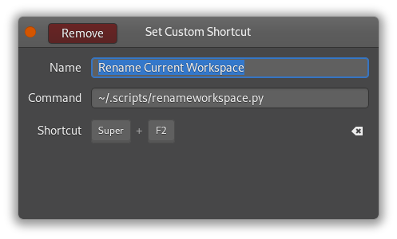

# gnome-rename-workspace
A simple Python script to rename the current GNOME Workspace. 

<div align="center">

<br>View of <a href="https://extensions.gnome.org/extension/3851/workspaces-bar/">Workspace Bar</a> GNOME Extension
</div>

<div align="center">

<br>Zenity dialog asking for new label
</div>

## Dependencies
The script runs on `python3` and requires `xdotool` to get the current workspace index, and `zenity` to ask for new label. 

Normally `python3` and `zenity` comes installed in any distro with GNOME, so you only need to install `xdotool` 

Fedora: 
```
sudo dnf install xdotool
```

Ubuntu, Debian:
```
sudo apt install xdotool
```

## Shortcut 
For convenience you can set an shortcut to run the script, I personally prefer `Super`+`F2` (since `F2` is normally used to rename stuff and `Super` is used to change between workspaces)

<div align="center">

</div>


## Credit
- Author: Gustavo Ale 
- GitHub: https://github.com/GustavoAle